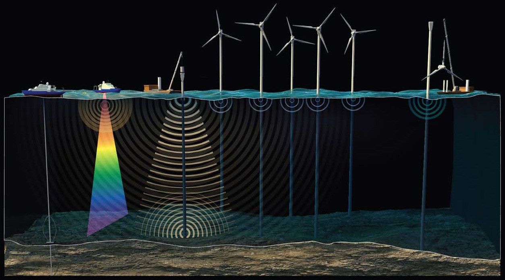

# Impact Producing Factors

## What is an Impact Producing Factor?

An action or activity, like offshore wind development, can result in one or more impact-producing factors (IPFs). Those IPFs illustrate how an action or activity affects relevant physical, biological, economic, or cultural resources. The effects or impacts resulting from the interaction between an IPF and a resource can be positive, negative, or neutral. Identifying multiple actions or activities and related IPFs, then, is one way to demonstrate cumulative impact on relevant resources to assess how vulnerable affected resources are to actions or activities.

For more information, see [BOEM (2019)](https://www.boem.gov/about-boem/ipfs-offshore-wind-cumulative-impacts-scenario-n-ocs).

.](images/IPFs-in-the-Offshore-Wind-Cumulative-Impacts-Scenario-on-the-N-OCS.jpg){.class width="100%"}

 Offshore wind development will result in 4 primary IPFs that may affect protected species. Those IPFs include:

-   Noise

-   Oceanographic Effects

-   Vessels

-   Presence of Structures

## Noise

Underwater noise is generated when objects underwater vibrate causing a pressure wave to travel through the water. Underwater noise, then, has components of both pressure and vibration that is often referred to as particle motion or velocity.

](images/L-Wave-Red.gif){.class width="100%"}

 Marine mammals, and to a lesser extent sea turtles, use underwater noise for a number of purposes that include communication, navigation, social interaction, reproduction, foraging, and predator avoidance or deterrence. Acoustic disturbance from underwater noise, then, has the potential to impact marine wildlife (marine mammals and sea turtles) in a variety of ways and to varying degrees depending on the characteristics of the noise (amplitude, frequency, duration, transmission loss), the environment, and the species. Those impacts can ultimately result in auditory injury or hearing loss, auditory masking, or behavioral changes that can be tricky to quantify. 

Man-made underwater noise can disrupt the normal behavior of marine wildlife. But the degree of disruption depends on a variety of factors, as discussed above. It is common to categorize that degree of disruption into zones: (1) zone of audibility, (2) zone of masking, (3) zone of responsiveness, and (4) zones of impairment and injury. 

.](images/Pages from Mooney-et-al-2020.png){.class width="100%"}

 For zones 1, 3, and 4, man-made underwater noise must be detected by the animal for a disruption to ensue. For zone 2, man-made underwater noise must augment the ambient noise in a way that limits detection of signals of interest by the animal (ie, changing the detection threshold).

All phases of offshore wind development emit noise. Those phases include (1) site surveys, (2) construction, (3) operations and maintenance, and (4) decommissioning.

{.class width="100%"}

 Underwater noise generated during an offshore wind farm's life cycle will vary by intensity and duration, as well as distance from the sound source. As an example, below is the sound from underwater pile-driving from 500 meters,

<html>
<audio controls>
  <source src="images/Piling @ 500m copy.m4a" type="audio/wav">
</audio></html>

This is what it would sound like from more than 18 miles away (35 km) away,

<html>
<audio controls>
  <source src="images/Piling @ 30km.m4a" type="audio/wav">
</audio></html>

Sound files from [UMCES](https://www.umces.edu/cbl/story/2013/oct/16/assessing-impact-noise-offshore-wind-farm-construction-may-help-protect-marine-mam).

Refers to noise from various sources. Commonly associated with construction activities, geophysical and geotechnical surveys, naval testing and training, and vessel traffic. May be impulsive, e.g., pile driving or weapons detonation, or may be broad spectrum and continuous, e.g., cumulative noise from marine transportation vessels. May also be from natural sources, e.g., wind and wave action.

### Examples

-   G&G (Geological & Geophysical)
-   O&M (Operation & Maintenance)
-   Pile driving
-   Turbines
-   Vessels
